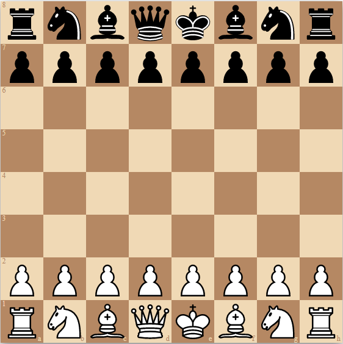

<div align="center" markdown="1">

# react-chessboard-svg



## The React Chessboard SVG Library used at [ChessOpenings.co.uk](https://chessopenings.co.uk)

[![Pull Requests][prs-badge]][prs] [![Version][version-badge]][version] [![MIT License][license-badge]][license]

</div>

## What is react-chessboard-svg?

react-chessboard-svg is a React component that generates an SVG of a chessboard when provided a FEN string.

Link to react-chessboard and [ChessOpenings.co.uk](https://chessopenings.co.uk)

## Installation

```
npm i react-chessboard-svg
```

## Usage

```jsx
import { ChessboardSVG } from 'react-chessboard-svg';

export default function App() {
  return <ChessboardSVG fen="r1bqkbnr/pppp1ppp/2n5/4p3/2B1P3/5N2/PPPP1PPP/RNBQK2R b KQkq - 3 3" />;
}
```

## Contributing

1. Fork this repository
2. Clone your forked repository onto your development machine
   `git clone https://github.com/yourUsernameHere/react-chessboard-svg.git`
   `cd react-chessboard-svg`
3. Create a branch for your PR
   `git checkout -b your-branch-name`
4. Set upstream remote
   `git remote add upstream https://github.com/Clariity/react-chessboard-svg.git`
5. Make your changes
6. Test your changes using the example folder
   `npm run build`
   `cd example`
   `npm start`
7. Push your changes
   `git add .`
   `git commit -m "feature/cool-new-feature"`
   `git push --set-upstream origin your-branch-name`
8. Create pull request on GitHub
9. Contribute again
   `git checkout main`
   `git pull upstream main`
   `git checkout -b your-new-branch-name`

## LICENSE

MIT

[prs-badge]: https://img.shields.io/badge/PRs-welcome-brightgreen.svg?style=flat-square
[version-badge]: https://img.shields.io/npm/v/react-chessboard-svg.svg?style=flat-square
[license-badge]: https://img.shields.io/npm/l/react-chessboard-svg.svg?style=flat-square
[prs]: https://egghead.io/courses/how-to-contribute-to-an-open-source-project-on-github
[version]: https://www.npmjs.com/package/react-chessboard
[license]: https://github.com/Clariity/react-chessboard-svg/blob/main/LICENSE
